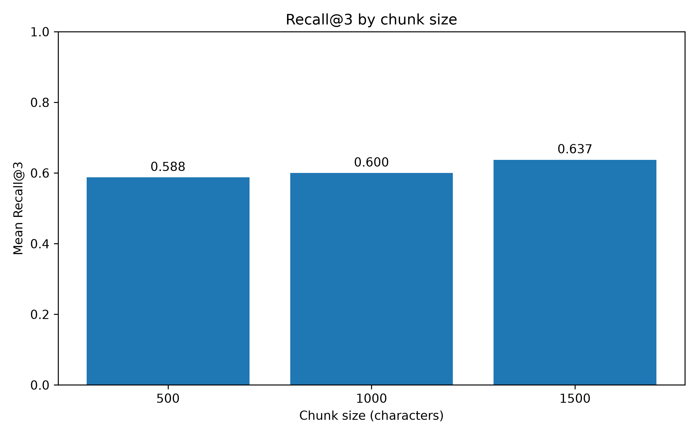
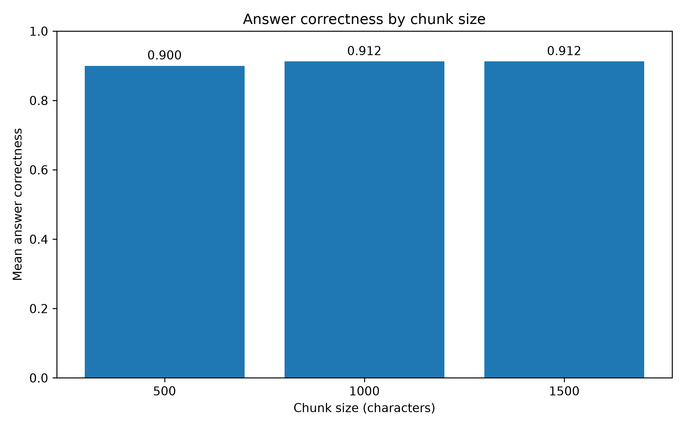
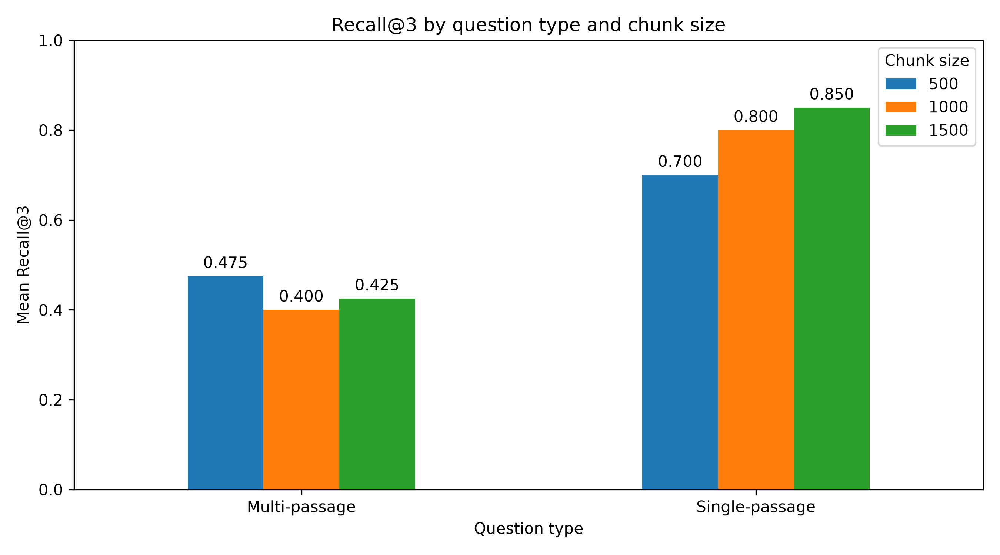
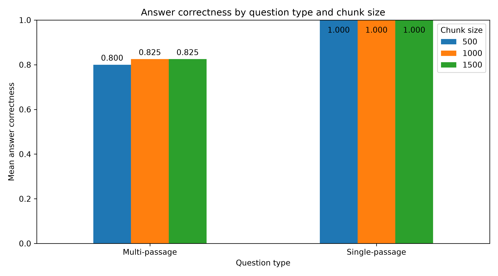

# Skriftlig rapport
## Syfte
Med tanke på AIs framväxt och dess relation till datahantering ville jag fördjupa mig lite mer i ämnet – jag ville förstå mer om hur AI fungerar, hur man mäter dess resultat och hur olika designval påverkar resultatet. 
RAG passade mitt projekt eftersom jag ville undersöka hur en språkmodell kan använda specifik information för att besvara frågor. Jag behövde inte träna om modellen, utan kunde istället hämta relevant information från mina dokument och skicka den som kontext till modellen. Det gjorde det lättare att följa retrieval processen när en fråga ställdes vilket var vad jag ville fokusera på. Jag valde att titta på hur olika chunk-storlekar påverkar retrieval quality och answer correctness i ett RAG-system. Fokuserade på dessa två frågor:
1. Hur förändras answer quality med olika chunk sizes?
2. Vilket mätvärde visar störst variation?
## Området och dess relevans
Data Science har utvecklat ett nära partnerskap med AI, där det fungerar som ett kraftfullt verktyg som data scientists bygger, tränar och använder för att lösa komplexa problem. Det är mer relevant än någonsin att Data Scientists utvecklar en djup förståelse för hur AI fungerar, hur det kan hjälpa oss i vårt arbete, men också när det inte fungerar och hur man kvalitetssäkrar resultatet.
## Viktiga begrepp
RAG (Retrieval-Augmented Generation) - Hämtar relevant information innan modellen genererar ett svar.
Embedding – är i grunden ett sätt att omvandla text till en lista med siffror så att betydelsen följer med. Det låter en dator jämföra vad texter faktiskt handlar om, inte bara vilka bokstäver de innehåller – och det är motorn bakom modern sökning och RAG.
Vektor –  när embedding omvandlar text till lång lista med siffror – kallas den listan för en vektor.
Chunks - Ett dokument delas upp i mindre textdelar som kan sökas och hämtas.
## Genomförande
### Datasetet 
Jag använde ursprungligen Single-Topic RAG Evaluation Dataset | Kaggle för det här projektet, men efter att ha byggt min pipeline och testat den insåg jag att det fanns ett stort problem med datasetet. Basdokumentet: ´documents.csv´,  verkade ha förlorat viss del av datan som behövdes för att besvara frågorna som tillhörde datasetet. När jag ställde frågor som egentligen skulle ha kunnat besvaras kunde modellen därför inte hitta svar i flera fall.
Efter att ha testat detta och manuellt gått igenom att det skulle vara för tidskrävande att försöka identifiera och åtgärda det här datasetet så sökte vidare efter ett dataset. 
#### Skapandet av ett eget dataset
Till en början försökte jag hitta andra färdiga dataset, men upplevde ofta att de inte passade den typ av RAG-utvärdering som jag ville genomföra. Därför valde jag istället att skapa ett eget dataset.
Jag laddade ner 10 Wikipedia-artiklar om 10 olika länder i Afrika söder om Sahara och använde ChatGPT för att strukturera materialet och skapa frågor och svar enligt följande format.
För varje en av de 10 artiklarna skapade jag:
- 2 single-passage-frågor 
- 2 multi-passage-frågor 
- 2 no-answer-frågor 

Det gav totalt 60 frågor.

Frågorna delades in i tre typer:
1.	Single-passage-frågor → Svaret ska kunna hittas i ett identifierbart textavsnitt. 
2.	Multi-passage-frågor → Svaret ska kräva information från minst två olika textavsnitt. 
3.	No-answer-frågor → Svaret ska inte kunna styrkas någonstans i dokumentet. 

Separata referenssvar
Referenssvaren hölls medvetet separerade från den text som RAG-systemet har tillgång till. Den slutliga datastrukturen blev därför:
1.	documents.csv – Texten från de 10 PDF-artiklarna extraherades och formatering och mellanrum normaliserades. Varje artikel fick även ett unikt document_id. Detta är det dokument som RAG-systemet har tillgång till. 
2.	all_questions.csv – Innehåller alla frågor tillsammans med stödjande källtext och document_id. 
3.	single_passage_questions.csv – Innehåller frågorna av typen single-passage. 
4.	multi_passage_questions.csv – Innehåller frågorna av typen multi-passage. 
5.	no_answer_questions.csv – Innehåller frågorna där svaret inte finns i dokumenten. 

### Mätvärden
#### Primära mätvärden
##### Retrieval quality – kvalitet på informationshämtningen
Att utvärdera retrieval quality i en RAG-pipeline innebär att undersöka om systemet hittar och rangordnar den information som behövs för att besvara användarens fråga innan informationen skickas vidare till språkmodellen.
Jag hittade flera möjliga sätt att utvärdera detta, men med tanke på projektets tidsbegränsningar valde jag en relativt enkel utvärderingsmetrik: Recall@k, där k anger antalet av de högst rankade resultaten som utvärderas.

Eftersom k = 3 i det här projektet använde jag Recall@3. I min implementation definieras en träff genom att den normaliserade stödtexten måste återfinnas som en substring i de tre hämtade chunkarna. Mätvärdet mäter därför inte semantisk relevans direkt, utan om den fördefinierade stödtexten kan återfinnas i retrieval-resultatet.

Eftersom RAG-systemet delar upp källdokumenten i chunks kommer den stödjande texten i all_questions.csv inte nödvändigtvis att vara identisk med en komplett chunk. 
Jag testade först en överlappningströskel för att avgöra om en chunk innehöll tillräckligt mycket av stödtexten. Resultatet var svårt att tolka på ett tillförlitligt sätt, så jag valde istället en enklare och reproducerbar metod där den normaliserade stödtexten måste återfinnas i de hämtade chunkarna. Detta gjordes genom att skapa stödtexten: ´all_questions.csv´.

##### Answer correctness – svarens korrekthet
Answer correctness mäter hur väl ett genererat svar överensstämmer med en fördefinierat referens- eller facitsvar, både när det gäller faktamässig korrekthet och semantisk innebörd.
För att utvärdera detta mätvärde valde jag att använda LLM-as-a-judge. Det innebär att en språkmodell får rollen som utvärderare och får tillgång till:
•	frågan som ställdes, 
•	referenssvaret från all_questions.csv, och 
•	svaret som genererades av RAG-systemet. 
Språkmodellen ombeds sedan avgöra om det genererade svaret korrekt besvarar frågan.
Problemet med denna metod är att när en LLM används för att bedöma en annan LLM:s svar blir utvärderingen inte lika objektiv som en exakt numerisk jämförelse. För en mindre experimentell RAG-studie som denna fyller metoden dock sitt syfte.
#### Sekundärt mätvärde
#####   No-answer handling
No-answer handling  las till senare i projektet för att hantera andelen frågor som inte kan besvaras där systemet på ett korrekt sätt avstår från att ge ett svar eller tydligt markerar att informationen saknas.
Recall@3 mäter kvaliteten på informationshämtningen, answer correctness mäter kvaliteten på svaren på de frågor som faktiskt går att besvara, och no-answer handling rate mäter systemets förmåga att undvika osupporterade svar när den information som krävs saknas.
### Text processing
#### Chunks
Målet med projektet är att undersöka hur RAG-systemets kvalitet påverkas av olika chunk-storlekar. Jag valde tre olika chunk-storlekar baserade på antal tecken: 500, 1000 och 1500 tecken. Syftet var inte att anta att någon av dem var optimal, utan att skapa tre olika experimentella nivåer. Jag höll resten av RAG-pipelinen konstant och ändrade endast chunk-storleken för att kunna undersöka hur den påverkade retrieval quality och answer correctness.
Mindre chunks kan göra retrieval mer precist eftersom varje chunk innehåller mindre information, men kan samtidigt göra att sammanhängande information delas upp. Större chunks kan däremot innehålla mer av det sammanhang som behövs för att besvara en fråga, men kan samtidigt innehålla mer irrelevant information.
### Embeddings
Efter att dokumenten delats upp  skapas embeddings för varje chunk. Jag använde mig av ´text-embedding-3-small´ från OpenAi. Jag valde att inte lagra embeddings i en vektordatabas, istället behålls chunks och embeddings i Python-objekt och jämförs direkt. Nackdelen är att varje fråga kräver en jämförelse mot alla embeddings, vilket fungerar för det lilla datasetet men inte skulle vara lämpligt för mycket stora mängder dokument.
### Retrieval
När användaren ställer en fråga skapas en embedding för frågan. Sedan jämförs denna embedding med embeddings för alla chunks genom ´cosine similarity´. Cosine similarity jämför vinkeln mellan två vektorer, så ett högre värde innebär att vektorerna pekar mer åt samma håll och används därför som ett mått på semantisk likhet mellan frågan och chunken. Sedan sorteras resultaten efter likhet och systemet hämtar de tre högst rankade chunkarna (top_k = 3). 
### Generation
De tre hämtade chunkarna kombineras sedan till ett kontext som skickas till ´GPT-5.6 Luna´.
Modellen använder frågan tillsammans med den hämtade texten för att generera det slutliga svaret. 
### Evaluation
Det huvudsakliga syftet med projektet var att undersöka hur chunk-storleken påverkar systemets kvalitet. Jag använde två primära mätvärden och ett sekundärt mätvärde:
-	Recall@3 - Mäter retrieval quality. Evaluation svarade på frågan: ”Hittade systemet den relevanta informationen bland de tre chunks som hämtades?”
-	Answer correctness - Mäter hur korrekt det genererade svaret är jämfört med ett referenssvar genom LLM-as-a-judge.
-	No-answer-frågor - Dessa används för att undersöka om systemet kan hantera situationen där det saknas tillräckligt med information.
## Resultat
### Resultat enligt chunk storlek

  

    
    
<em>Figur 1. Retrieval quality för de tre testade chunk-storlekarna.</em>

  

  

    
    
<em>Figur 2. Answer correctness för de tre testade chunk-storlekarna.</em>

  

                        | Chunk-storlek |  Recall@3 | Answer correctness  |
                        | ------------: | --------: | ------------------: |
                        |       **500** |     0,588 |               0,900 |
                        |      **1000** |     0,600 |              0,9125 |
                        |      **1500** |     0,637 |              0,9125 |

1. Retrieval quality förbättrades med större chunks, vilket innebär att systemet hittade mer av den stödjande informationen när chunk-storleken ökade. Skillnaden mellan 500 och 1500 tecken var ungefär 0,049, alltså 4,9 procentenheter.

2. Answer correctness förändrades väldigt lite från 500 till 1000 tecken, men ingen ytterligare förbättring syntes mellan 1000 och 1500. Så trots att 1500 hade högst Recall@3 gav det inte bättre genomsnittlig answer correctness än 1000.

### Resultat enligt frågtyp

  

    
    
<em>Figur 3. Retrieval quality för de tre frågetyperna.</em>

  

  

    
    
<em>Figur 4. Answer correctness för de tre frågetyperna.</em>

  

Om vi tittar på statistiken enligt dem olika frågetyperna så ser man en tydlig skillnad:
- Single-passage-frågorna var stabila för answer correctness – alla tre chunk-storlekarna gav helt korrekta svar enligt utvärderingen för dessa frågor. Recall@3 däremot ökade - Det visar en viktig skillnad mellan dem två mätvärdena: retrieval kunde förändras även när det slutliga svaret förblev korrekt.
- Multi-passage-frågorna var mer känsliga – det var större variation mellan chunk-storlekarna på Recall@3. För answer correctness ändrades det inte efter chunk storlek 1000. Det kan innebära att multi-passage-frågorna var svårare för retrieval-systemet, eftersom systemet måste hitta information från flera olika textdelar.
- No-answer-frågorna förblev 0 oberoende av chunk storlek. Kan betyda att systemet inte lyckades hantera dessa frågor enligt det försatta kriteriumet. 

I detta experiment hade chunk-storleken en tydligare effekt på retrieval quality än på answer correctness. Större chunks gav generellt högre Recall@3, men förbättringen i faktisk svarskorrekthet var liten. Resultaten tyder därför på att bättre retrieval inte nödvändigtvis översätts till proportionellt bättre genererade svar.

## Begränsningar och möjliga förbättringar
### No-Answer frågorna 
Resultatet visar att no-answer-frågorna inte påverkades av chunk-storleken. Det tyder på att begränsningen främst ligger i systemets arkitektur snarare än i chunkingen. Den nuvarande implementationen saknar en separat mekanism för att avgöra om den hämtade kontexten innehåller tillräckligt stöd för ett svar. En möjlig vidareutveckling skulle därför vara att införa en answerability- eller confidence-threshold innan svaret genereras.
### Ingen overlap mellan chunks
I den nuvarande implementationen används ingen overlap mellan chunks. Det innebär att relevant information som ligger nära gränsen mellan två chunks kan delas upp mellan dem. En möjlig förbättring skulle vara att använda chunk overlap , exempelvis att en viss del av föregående chunk inkluderas i nästa.
### LLM-as-a-judge är inte helt objektivt
LLM-as-a-judge är praktiskt för ett mindre experiment, men det finns en risk att den utvärderande modellen gör bedömningar som en mänsklig expert skulle ha bedömt annorlunda.En möjlig förbättring skulle vara att använda flera olika LLMs eller andra metrics såsom mänsklig bedömning. 
### Litet dataset
Datasetet är relativt litet och består av 10 dokument och 60 frågor. Resultaten bör därför främst tolkas som observationer från detta experiment och inte som generella slutsatser om vilken chunk-storlek som fungerar bäst för RAG-system.

## Koppling till yrkesrollen
När jag antog mig projektet ville jag lära mig hur jag kunde bygga en experimentell datapipeline där jag kan testa en AI-lösning. Men nu vid dess slut har jag lärt mig så mycket mer färdigheter som är högst relevanta för en data scientist:
- jag fick lära mig om flera olika mätvärden som används för AI-lösningar och hur jag definierade vad "bra" betyder
- jag lärde mig hur jag skapar och kvalitetssäkrar dataset
- hur man arbetar med LLM (OpenAI) för retrieval, generering och utvärdering
- doppade tårna i hallucinationsproblematiken i LLMs genereringsprocess
- jobbade på att testa och förbättra experimentet iterativt.
- fick hantera trade-offs mellan olika val- exempel använda LLM-as-judge vilket inte är objektivt men en funktionell lösning för det här projektet.
Allt detta och mycket mer som jag tror kommer att bli användbart i min roll. 

## Källor
### Dataset - Wikipedia
- Mozambique (2026) https://en.wikipedia.org/wiki/Mozambique (Accessed: 19 September 2026).
- Tanzania (2026)https://en.wikipedia.org/wiki/Tanzania (Accessed: 19 September 2026).
- South Africa (2026)https://en.wikipedia.org/wiki/South_Africa (Accessed: 19 September 2026).
- Eswatini (2026)https://en.wikipedia.org/wiki/Eswatini (Accessed: 19 September 2026).
- Lesotho (2026)https://en.wikipedia.org/wiki/Lesotho (Accessed: 19 September 2026).
- Zimbabwe (2026)https://en.wikipedia.org/wiki/Zimbabwe (Accessed: 19 September 2026).
- Malawi (2026)https://en.wikipedia.org/wiki/Malawi (Accessed: 19 September 2026).
- Kenya (2026)	https://en.wikipedia.org/wiki/Kenya (Accessed: 19 September 2026).
- Botswana (2026)https://en.wikipedia.org/wiki/Botswana (Accessed: 19 September 2026).
- Angola (2026)	https://en.wikipedia.org/wiki/Angola (Accessed: 19 September 2026).

### Det ursprungliga datasetet:
- Harris, Samuel Matsuo (2025) Single-Topic RAG Evaluation Dataset. Available at: https://www.kaggle.com/datasets/samuelmatsuoharris/single-topic-rag-evaluation-dataset?resource=download (Accessed: 26 August 2026).
### Artiklar

- Abdul Sami, Muhammad (2026) RAG Evaluation: How to Measure Retrieval Quality Before. Available at: https://hinterbuild.com/blog/rag-evaluation-measure-retrieval-quality#why-retrieval-first (Accessed: 31August 2026).
- Evidently AI (2025) Precision and recall at K in ranking and recommendations. Available at: https://www.evidentlyai.com/ranking-metrics/precision-recall-at-k  (Accessed: 10 September 2026).
- Kannappan, Ganesh (2024) Evaluation of Retrieval Augmented Generation (RAG) — Part 3. Available at: https://medium.com/@ganeshkannappan/evaluation-of-retrieval-augmented-generation-rag-part-3-ae7b085ceee5 (Accessed: 10 September 2026).
- Mistral AI Team (2025) Evaluating RAG with LLM as a Judge. Available at: https://mistral.ai/news/llm-as-rag-judge/ (Accessed: 2 September 2026).
- Nguyen , Xuan-Son (2024) Code a simple RAG from scratch. Available at: https://huggingface.co/blog/ngxson/make-your-own-rag (Accessed: 2 September 2026).
- Patronus AI (2026) RAG Evaluation Metrics: Best Practices for Evaluating RAG Systems. Available at: https://www.patronus.ai/llm-testing/rag-evaluation-metrics (Accessed: 2 September 2026).
- Yousefiniyae shad, Mazyar (2025) Building Your First RAG System with Python and OpenAI.Available at: https://dev.to/mazyaryousefinia/building-your-first-rag-system-with-python-and-openai-1326 (Accessed: 2 September 2026). 
### Youtube videos

- Grigorev, Alexey(2026) Build Your First RAG Application with LLMs - Alexey Grigorev [YouTube video]. Available at: https://www.youtube.com/watch?v=KSItlTAsMsk&t=1042s [Accessed: 3 September 2026].
- KodeKloud (2025) RAG Crash Course for Beginners [YouTube video]. Available at: https://www.youtube.com/watch?v=swvzKSOEluc [Accessed: 4 September 2026].
- Unfold Data Science (2025) Build Your First RAG App in 10 Minutes | RAG application tutorial | RAG application development [YouTube video]. Available at: https://www.youtube.com/watch?v=VeZXHb2VXtM [Accessed: 4 September 2026].

# Självreflektion

## 1. Vad lärde du dig som du inte kunde innan?
Jag lärde mig att bygga en experimentell datapipeline där jag kunde testa hur ett RAG-system kan använda specifik information för att besvara frågor. Jag lärde mig bland annat hur embeddings används för att representera text numeriskt, vad chunks innebär och hur retrieval-delen använder embeddings för att hitta relevanta textdelar. Detta var ett koncept som jag hade svårt att greppa i början, men som jag förstår betydligt bättre efter projektet.
## 2. Vad var svårast att förstå eller genomföra?
Det svåraste var framför allt att förstå hur olika delar av RAG-pipelinen hänger ihop, särskilt sambandet mellan embeddings, retrieval och generation.
Jag hade också stora svårigheter med no-answer-frågorna. Systemet hämtar alltid de tre mest lika chunkarna, även när informationen som behövs för att besvara frågan inte finns i dokumenten. Det saknades därför en separat mekanism för att avgöra när systemet borde avstå från att svara. Detta gjorde no-answer-delen svårare att hantera än de andra frågetyperna.
## 3. Vilket tekniskt val är du mest nöjd med och varför?
Det tekniska val jag är mest nöjd med är att skapa ett eget dataset.
Det ursprungliga datasetet som jag använde visade sig inte fungera tillräckligt bra för mitt experiment eftersom viss information som behövdes för att besvara frågorna saknades i dokumenten. Genom att skapa ett eget dataset kunde jag själv kontrollera dokumenten, frågorna, referenssvaren och de olika frågetyperna.
## 4. Vad hade du gjort annorlunda om du började om?
Om jag började om hade jag planerat no-answer-delen tydligare från början. Jag hade då antingen utvecklat en separat mekanism för att bedöma om den hämtade kontexten faktiskt innehåller tillräckligt med information för att besvara frågan, eller avgränsat experimentet till retrieval och answer correctness för besvarbara frågor.
## 5. Vad skulle vara ett naturligt nästa steg om du fortsatte arbetet?
Ett naturligt nästa steg skulle vara att förbättra retrieval- och evaluation-delen.
Jag skulle exempelvis kunna testa chunk overlap och undersöka om information som ligger nära gränsen mellan två chunks då hämtas mer tillförlitligt. Jag skulle också kunna testa en större variation av chunk-storlekar och ett större dataset för att se om resultaten håller även när fler dokument och frågor används.
En annan möjlig vidareutveckling skulle vara att införa en mekanism för att avgöra när systemet inte har tillräckligt med information för att besvara en fråga. Det skulle göra det möjligt att förbättra no-answer-hanteringen.
## 6. Vilket betyg tycker du själv att arbetet motsvarar – G eller VG?
Jag bedömer att arbetet motsvarar VG.
## 7. Motivera din bedömning genom att koppla till kraven för G och VG.
Jag anser att arbetet uppfyller kraven för G eftersom jag har byggt och genomfört en fungerande RAG-lösning, använt relevanta bibliotek och tekniker, genomfört ett experiment och analyserat resultaten.
Jag anser samtidigt att arbetet uppfyller VG-kriterierna eftersom jag inte enbart har implementerat tekniken, utan även försökt förstå hur och varför de olika delarna fungerar och hur mina tekniska val påverkar resultatet.
Jag har bland annat:
- byggt en RAG-applikation med dokumentladdning, chunking, embeddings, retrieval och generering, 
- testat olika chunk-storlekar och analyserat hur de påverkar retrieval quality och answer correctness, 
- testat och utvärderat olika metoder och resonerat kring varför vissa val gjordes eller valdes bort, 
- skapat ett eget dataset när det ursprungliga datasetet inte fungerade för experimentets syfte, 
- använt tekniskt relevanta begrepp som embeddings, vectors, cosine similarity, Recall@3 och LLM-as-a-judge, 
- identifierat styrkor och begränsningar i både lösningen och de valda mätvärdena, 
- analyserat att förbättrad retrieval inte automatiskt innebär en motsvarande förbättring av answer correctness, 
- identifierat möjliga förbättringar, exempelvis chunk overlap, bättre no-answer-hantering och mer avancerad retrieval evaluation. 
